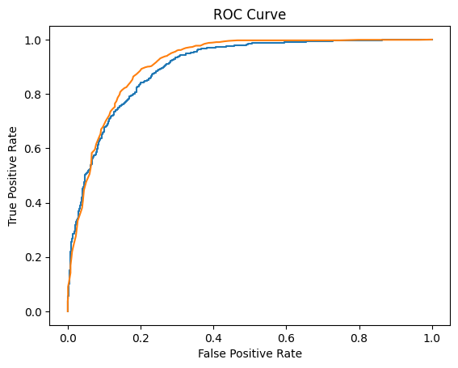

)
# Bank Marketing Subscription Prediction

Machine learning project predicting whether a customer will subscribe to a bank term deposit.

## Dataset
UCI Bank Marketing Dataset

## Workflow
- Data Cleaning
- Feature Engineering
- Model Training
- Hyperparameter Tuning
- Evaluation

## Models Used
- Logistic Regression
- Random Forest

## Result
Random Forest achieved ~90% accuracy.

## ROC Curve

